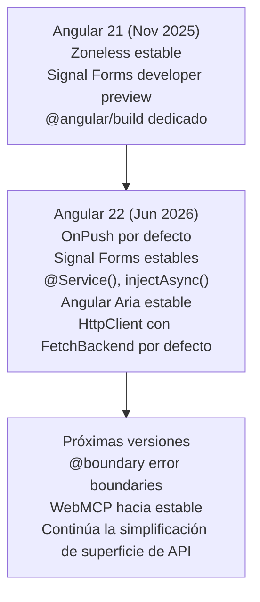

# Capítulo 37 - Parte 4: Angular Aria estable, templates y el ecosistema de Angular 22

> **Parte 4 de 4** · Capítulo 37 · PARTE XVI - Angular 22

Cerramos el capítulo con el resto de las piezas que Angular 22 estabiliza o mejora: una librería de accesibilidad headless, una serie de mejoras acumuladas en la sintaxis de templates, y una API de router más ergonómica para saber qué enlace está activo. Terminamos con un vistazo breve a lo que sigue en developer preview, dejando claro qué es estable hoy y qué todavía puede cambiar.

## Angular Aria: accesibilidad headless, estable

Angular Aria pasa a **estable** en la v22, con sus **doce patrones de interacción** (acordeones, árboles, comboboxes, tabs y el resto de patrones ARIA comunes) listos para producción, cada uno con su propio test harness.

La idea central de Angular Aria es una división de responsabilidades limpia: **vos aportás los estilos y la lógica de negocio, Angular Aria aporta el comportamiento de UI y la accesibilidad**. Son directivas headless (sin estilos propios) que manejan foco, interacción de teclado y estado ARIA correctamente, para que tu componente visual solo tenga que preocuparse de verse bien.

```typescript
// Ejemplo conceptual - un acordeón con comportamiento de Angular Aria
// y estilos completamente propios del proyecto
import { Component } from "@angular/core";
import {
  AccordionPattern,
  AccordionItemPattern,
} from "@angular/aria/accordion";

@Component({
  selector: "app-faq-acordeon",
  standalone: true,
  imports: [AccordionPattern, AccordionItemPattern],
  template: `
    <div ngAccordion>
      @for (pregunta of preguntas; track pregunta.id) {
        <div ngAccordionItem class="faq-item">
          <button ngAccordionTrigger class="faq-trigger">
            {{ pregunta.texto }}
          </button>
          <div ngAccordionPanel class="faq-panel">{{ pregunta.respuesta }}</div>
        </div>
      }
    </div>
  `,
})
export class FaqAcordeonComponent {
  protected preguntas = [
    /* ... */
  ];
}
```

Angular Aria encaja especialmente bien en tres escenarios: **design systems** internos donde el equipo controla el look visual completo, **librerías de componentes de empresa** reutilizadas entre múltiples apps, y proyectos con **requisitos de marca muy específicos** donde Angular Material sería demasiado rígido.

→ Ver Capítulo 34, Parte 3 y 4 para los fundamentos de accesibilidad (HTML semántico, roles ARIA, gestión de foco) que Angular Aria automatiza - y Capítulo 29, Parte 3 para el paquete `a11y` del CDK, que sigue siendo la base de más bajo nivel sobre la que Angular Aria construye estos patrones.

## Mejoras acumuladas en la sintaxis de templates

Varias mejoras de templates llegaron en versiones `21.x` y se consolidan en Angular 22. Todas apuntan a lo mismo: reducir código repetitivo en el template sin salir del template.

### Spread y rest en bindings y `@for`

```html
<!-- Spread de objetos en bindings -->
<div [class]="{ ...clasesBase, activo: estaActivo() }"></div>

<!-- Spread al construir arrays para iterar -->
<ul>
  @for (item of [...preferidos, ...resto]; track $index) {
  <li>{{ item }}</li>
  }
</ul>

<!-- Rest en llamadas a funciones dentro del template -->
{{ sumar(...numeros()) }}
```

### `@switch` exhaustivo con `never()`

`@switch` ahora puede validar en tiempo de compilación que se cubrieron todos los casos de un tipo unión, usando `never` en el `@default`:

```typescript
type Estado = "cargando" | "listo" | "error";
protected estado: Estado = "cargando";
```

```html
@switch (estado) { @case ('cargando') {
<p>Cargando...</p>
} @case ('listo') {
<p>Listo</p>
} @case ('error') {
<p>Error</p>
} @default never;
<!-- Si falta un caso del tipo unión, error de compilación -->
}
```

Para uniones discriminadas donde el `@default` sí necesita ejecutar algo en el caso "imposible" (por ejemplo, loguear un valor inesperado), `never(expr)` acepta la expresión que debería ser de tipo `never`:

```html
@switch (estado.modo) { @case ('mostrar') { {{ estado.contenido }} } @case
('ocultar') {} @default never(estado);
<!-- Falla en compilación si "estado" no es exhaustivamente "never" aquí -->
}
```

`@switch` también soporta agrupar múltiples valores bajo el mismo bloque, útil para evitar duplicar markup:

```html
@switch (rol) { @case ('admin') @case ('superadmin') {
<span class="badge">Acceso total</span> } @case ('editor') {
<span class="badge">Solo edición</span> } @default {
<span class="badge">Solo lectura</span> } }
```

### Funciones flecha inline y comentarios en elementos

```html
<!-- Funciones flecha directamente en el template - sin declarar un método aparte -->
@for (item of items(); track item.id) {
<button (click)="seleccionar((x) => x.id === item.id)">Seleccionar</button>
}
```

```html
<!-- Comentarios de línea y de bloque dentro de las etiquetas -->
<div
  // Botón primario - ver guía de diseño interna
  class="btn btn-primary"
  /*
    Nota: solo aplica cuando "cargando" es false
  */
  [disabled]="cargando()"
></div>
```

### Optional chaining: nueva semántica

El operador `?.` en expresiones de template ahora propaga `undefined` de forma consistente cuando la cadena se corta en un valor `null`/`undefined`, en vez de comportamientos inconsistentes según el punto de corte. Para el comportamiento legado (previo a este cambio), está disponible `$null(...)`.

```html
<!-- Si "usuario()" es undefined, toda la cadena resuelve a undefined -->
<p>{{ usuario()?.direccion?.ciudad }}</p>

<!-- $null(...) preserva el comportamiento anterior a Angular 22, si algún caso lo necesita -->
<p>{{ $null(usuario()?.direccion)?.ciudad }}</p>
```

## Router: `isActive()` como Signal

`isActive()` reemplaza el caso de uso programático de `routerLinkActive` cuando se necesita el estado "¿esta ruta está activa?" fuera del propio `[routerLink]` - por ejemplo, para lógica condicional en la clase del componente:

```typescript
import { Component, inject } from "@angular/core";
import { isActive, Router } from "@angular/router";

@Component({ selector: "app-nav", standalone: true, template: `...` })
export class NavComponent {
  private router = inject(Router);

  protected readonly busquedaActiva = isActive(
    "/reservas/busqueda-vuelo",
    this.router,
  );

  protected readonly resumenActiva = isActive(
    "/reservas/resumen",
    this.router,
    { paths: "exact" },
  );
}
```

```html
<a [routerLink]="['./busqueda-vuelo']" [class.active]="busquedaActiva()">
  Buscar vuelo
</a>
```

→ Ver Capítulo 10, Parte 2 para `routerLinkActive`, que sigue siendo la opción correcta para el caso simple de resaltar un enlace en el template - `isActive()` es la alternativa cuando esa lógica necesita vivir en TypeScript.

## Lo que sigue en preview: WebMCP y `@boundary`

Dos piezas de Angular 22 están marcadas explícitamente como **experimentales/developer preview**, no estables - vale la pena conocerlas pero no adoptarlas como si fueran API definitiva:

- **WebMCP** (experimental): expone herramientas de la aplicación y de Signal Forms a agentes de IA que corren en el navegador, mediante un dev server de MCP. Es la apuesta de Angular por integrarse con flujos de desarrollo asistido por IA, pero la superficie de API todavía puede cambiar.
- **`@boundary`** (developer preview, previsto para Q3 2026): sintaxis de template para error boundaries declarativos, pensada para capturar errores de renderizado a nivel de bloque sin envolver todo el árbol de componentes en lógica de manejo de errores.

Ninguna de las dos reemplaza nada de lo cubierto en los capítulos anteriores de esta guía; son adiciones al margen, no breaking changes.

## Cierre del capítulo



## Puntos clave

- Angular Aria es estable en v22: doce patrones headless de accesibilidad con test harnesses, pensados para design systems y librerías de componentes propias
- Spread/rest en bindings, `@switch` exhaustivo con `never()`, funciones flecha inline y comentarios en elementos son mejoras acumuladas de sintaxis de templates, todas estables en v22
- El operador `?.` en templates cambió su semántica para propagar `undefined` de forma consistente; `$null(...)` preserva el comportamiento anterior donde haga falta
- `isActive()` da acceso programático al estado de una ruta activa como Signal, complementando (no reemplazando) `routerLinkActive`
- WebMCP y `@boundary` son developer preview/experimental en v22 - útiles para explorar, no para depender de su API todavía

## ¿Qué sigue?

Con este capítulo, la guía queda al día con Angular 22, la versión estable más reciente al momento de escribir esto. Como se explica en el `README.md`, esta guía es un documento vivo: a medida que Angular libere nuevas versiones, se agregarán capítulos siguiendo este mismo formato - siempre basados en la documentación oficial (`angular.dev`) y el changelog del repositorio `angular/angular`.
